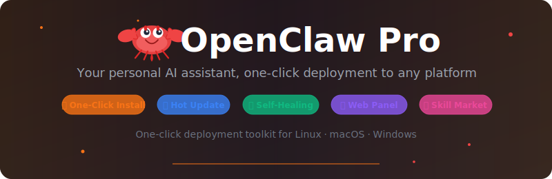
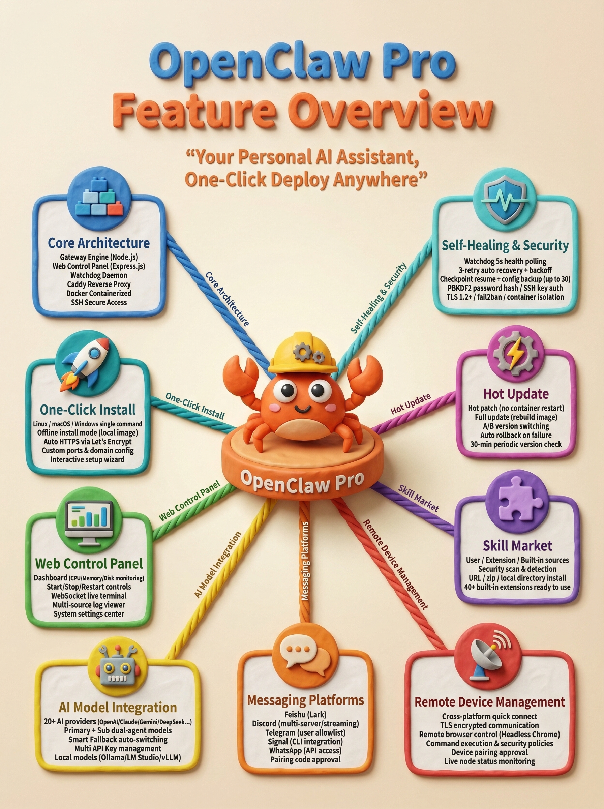
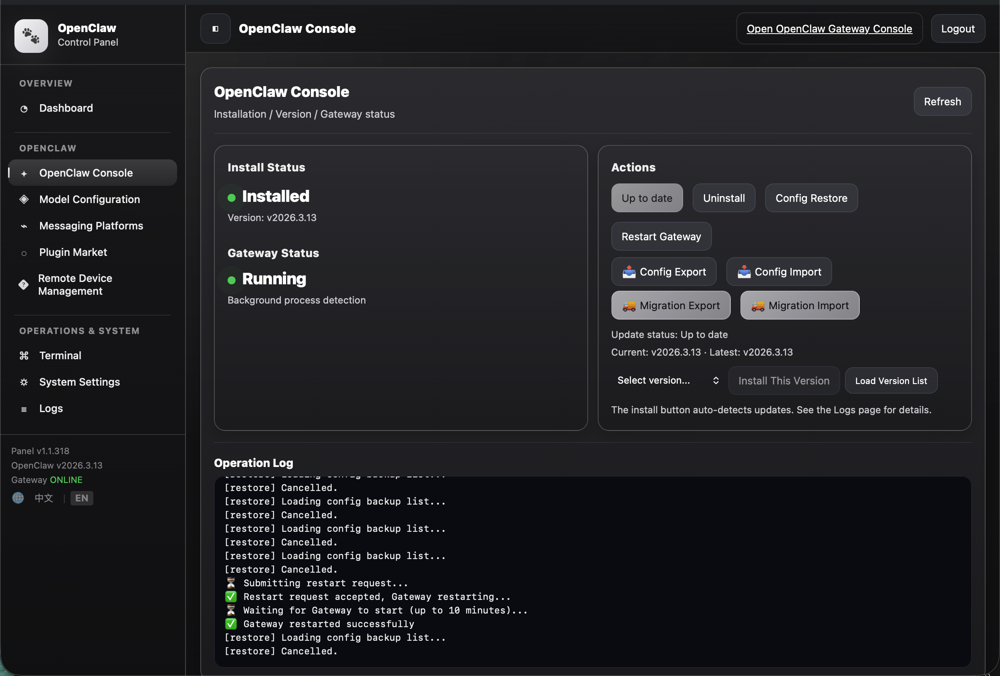

<p align="center">
  
</p>

<p align="center">
  <a href="https://github.com/cintia09/openclaw-pro/releases"></a>
  <a href="LICENSE"></a>
  <a href="https://github.com/cintia09/openclaw-pro/stargazers"></a>
</p>

<p align="center">
  <strong>Your personal AI assistant, one-click deployment to any platform.</strong>
</p>

<p align="center">
  <a href="README.zh-CN.md">中文</a> ·
  <a href="https://github.com/openclaw/openclaw">OpenClaw</a> ·
  <a href="#one-click-install">Install</a> ·
  <a href="https://docs.openclaw.ai">Docs</a>
</p>

---

[OpenClaw](https://github.com/openclaw/openclaw) is an open-source personal AI assistant that connects to 20+ platforms including Discord, Feishu (Lark), WeChat, Telegram, Slack, WhatsApp, and more. Through a flexible Skills and Extensions mechanism, it integrates AI into your daily workflow.

**OpenClaw Pro** is a **one-click deployment toolkit** for Linux, macOS, and Windows, providing:

- 🚀 **One-Click Install** — A single command handles Docker image pull, container creation, and Gateway startup
- 🔄 **Hot Update** — One-click upgrade from the Web control panel with A/B version swap and auto-rollback
- 🛡️ **Self-Healing** — Gateway Watchdog health monitoring, automatic recovery, and runtime checkpoint resumption
- 🎨 **Web Control Panel** — Visual management for config, models, skill plugins, install/update status
- 🧩 **Skill Market** — Browse, install, and update community skill packages online

<p align="center">
  
</p>

<p align="center">
  
</p>

## One-Click Install

### Linux / macOS

```bash
curl -fsSL https://raw.githubusercontent.com/cintia09/openclaw-pro/main/install.sh | bash
```

### Windows (Administrator PowerShell)

Windows installation currently uses the Docker Desktop approach only.
Please install and start Docker Desktop first, then run the install command below.

```powershell
irm https://raw.githubusercontent.com/cintia09/openclaw-pro/main/install-windows-bootstrap.ps1 | iex
```

Or download and run `install-windows.bat` as Administrator.

## Local Install (Offline)

If you have limited internet access or prefer offline installation, download both the **source code** and the **Docker image** (`openclaw-pro-image-lite.tar.gz`) from the [Releases](https://github.com/cintia09/openclaw-pro/releases) page.

### Linux / macOS

```bash
tar xzf openclaw-pro-*.tar.gz
cp openclaw-pro-image-lite.tar.gz openclaw-pro-*/
cd openclaw-pro-*
bash install-imageonly.sh
```

### Windows (Administrator PowerShell)

```powershell
Expand-Archive openclaw-pro-*.zip -DestinationPath .
Copy-Item openclaw-pro-image-lite.tar.gz -Destination openclaw-pro-*\
cd openclaw-pro-*
powershell -ExecutionPolicy Bypass -File install-windows.ps1
```

> The install script auto-detects the local image and skips downloading. The full interactive setup (ports, HTTPS, domain, etc.) runs as normal.

## License

[MIT](LICENSE)
