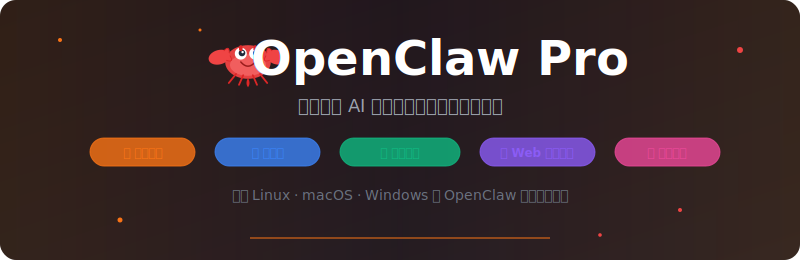

<p align="center">
  
</p>

<p align="center">
  <a href="https://github.com/cintia09/openclaw-pro/releases"></a>
  <a href="LICENSE"></a>
  <a href="https://github.com/cintia09/openclaw-pro/stargazers"></a>
</p>

<p align="center">
  <strong>你的私人 AI 助手，一键部署到任何平台。</strong>
</p>

<p align="center">
  <a href="README.md">English</a> ·
  <a href="https://github.com/openclaw/openclaw">OpenClaw</a> ·
  <a href="#一键安装">安装</a> ·
  <a href="#截图">截图</a> ·
  <a href="https://docs.openclaw.ai">文档</a>
</p>

---

[OpenClaw](https://github.com/openclaw/openclaw) 是一款开源的个人 AI 助手，支持接入 Discord、飞书、微信、Telegram、Slack、WhatsApp 等 20+ 平台，通过灵活的技能（Skills）和扩展（Extensions）机制，让 AI 真正融入你的日常工作流。

**OpenClaw Pro** 是面向 Linux、macOS、Windows 的 OpenClaw **一键部署工具**，提供：

- 🚀 **一键安装** — 一条命令完成 Docker 镜像拉取、容器创建、Gateway 启动
- 🔄 **热更新** — Web 控制面板内一键升级，支持 A/B 版本切换与自动回退
- 🛡️ **自愈能力** — Gateway Watchdog 健康监控、异常自动恢复、运行时断点续传
- 🎨 **Web 控制面板** — 可视化管理配置、模型、技能插件、安装/更新状态
- 🧩 **技能市场** — 在线浏览、安装、更新社区技能包

## 截图

<details open>
<summary><b>📸 Web 控制面板一览（点击展开/收起）</b></summary>
<br/>

<table>
  <tr>
    <td></td>
    <td></td>
  </tr>
</table>

</details>

## 一键安装

### Linux / macOS

```bash
curl -fsSL https://raw.githubusercontent.com/cintia09/openclaw-pro/main/install.sh | bash
```

### Windows（管理员 PowerShell）

Windows 安装当前仅保留 Docker Desktop 方案。
请先安装并启动 Docker Desktop，再执行下面的安装命令。

```powershell
irm https://raw.githubusercontent.com/cintia09/openclaw-pro/main/install-windows-bootstrap.ps1 | iex
```

或下载后以管理员身份运行 `install-windows.bat`。

## 本地安装（离线）

如果网络受限或希望离线安装，可从 [Releases](https://github.com/cintia09/openclaw-pro/releases) 页面同时下载**源码包**和 **Docker 镜像**（`openclaw-pro-image-lite.tar.gz`）。

### Linux / macOS

```bash
tar xzf openclaw-pro-*.tar.gz
cp openclaw-pro-image-lite.tar.gz openclaw-pro-*/
cd openclaw-pro-*
bash install-imageonly.sh
```

### Windows（管理员 PowerShell）

```powershell
Expand-Archive openclaw-pro-*.zip -DestinationPath .
Copy-Item openclaw-pro-image-lite.tar.gz -Destination openclaw-pro-*\
cd openclaw-pro-*
powershell -ExecutionPolicy Bypass -File install-windows.ps1
```

> 安装脚本会自动检测本地镜像文件并跳过下载，端口、HTTPS、域名等交互式配置流程与一键安装完全一致。

## 许可证

[MIT](LICENSE)
